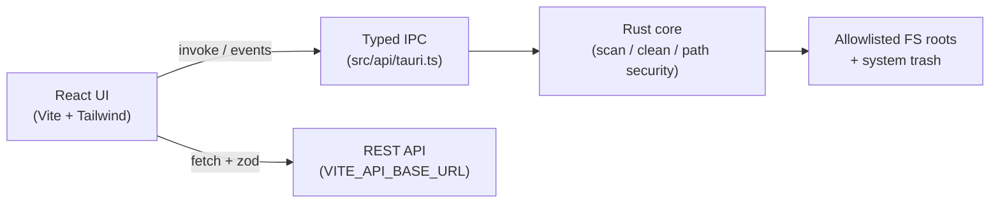

# CleanScope

[](https://github.com/koulibalyamadou10/cleanscop/actions/workflows/ci.yml)
[](https://github.com/koulibalyamadou10/cleanscop/actions/workflows/release.yml)

**CleanScope** is a production-quality proof-of-concept desktop utility built with **Tauri v2 + React + TypeScript**. It demonstrates signed-ready, cross-platform packaging of a React codebase for a cybersecurity / endpoint-hygiene product narrative: scan allowlisted temp & cache folders, preview junk in real time, and move selected items to the system trash (never permanent delete).

> Status snapshot: see [Status](#status) below for an honest done / not-done list.

## Screenshots

Run `npm run tauri dev` and capture the Dashboard / Scan views. A GIF or PNGs can be dropped into `docs/screenshots/` (folder reserved; not required for CI).

```
docs/screenshots/
  dashboard.png   # optional
  scan.png        # optional
```

## Architecture



## Features

- **Dashboard** — OS name/version, disk total/used/free, last scan summary
- **Scan** — allowlisted roots only (`dirs` crate), live progress events, category results (Temp / Cache / Logs), sortable
- **Clean** — `trash` crate (Recycle Bin / Trash), confirmation dialog, dry-run default, locked files skipped & reported
- **Alerts** — REST poll every 30s, zod validation, loading / offline / error states
- **Settings** — theme, API base URL display, allowlist visibility, security notes
- **CI / Release** — lint, typecheck, Vitest, cargo fmt/clippy/test; tagged releases build Windows / macOS / Linux installers

## Tech stack

| Layer | Stack |
| --- | --- |
| Desktop shell | Tauri v2 (Rust) |
| UI | React 18, TypeScript (strict), Vite, Tailwind CSS |
| Validation | zod (API), Rust path canonicalization |
| Tests | Vitest + React Testing Library, `cargo test` |
| Mock API | Java 21 + Spring Boot 3 (`/mock-backend`) |
| CI | GitHub Actions + `tauri-apps/tauri-action` |

## Prerequisites

- Node.js 20+
- Rust stable (`rustup`)
- Platform Tauri deps ([Tauri prerequisites](https://v2.tauri.app/start/prerequisites/))
- Optional: JDK 21 + Maven for the mock backend

## Setup

```bash
git clone https://github.com/koulibalyamadou10/cleanscop.git
cd cleanscop
cp .env.example .env
npm install
```

### Run the desktop app

```bash
npm run tauri dev
```

### Run the mock backend

```bash
cd mock-backend
mvn spring-boot:run
```

Endpoints:

- `GET /api/alerts`
- `POST /api/scan-reports` (Jakarta Validation on JSON body)

Set `VITE_API_BASE_URL=http://127.0.0.1:8080` in `.env` (see `.env.example`).

### Frontend quality gates

```bash
npm run lint
npm run typecheck
npm test
npm run build
```

### Rust quality gates

```bash
cd src-tauri
cargo fmt --check
cargo clippy --all-targets -- -D warnings
cargo test
```

### Production build (local)

```bash
npm run tauri build
```

Produces platform installers under `src-tauri/target/release/bundle/`.

## Security notes

- **Minimal Tauri capabilities** — `core:default` + `core:event:default` only. No shell plugin, no broad FS plugin from the frontend.
- **All filesystem work in Rust** — scan/clean commands; paths are canonicalized and must remain under allowlisted roots (unit-tested).
- **Strict CSP** in `tauri.conf.json` — no inline scripts, no remote script sources; API `connect-src` limited to localhost for the PoC.
- **Trash, not delete** — `trash` crate; confirmation required; dry-run is the default.
- **No secrets in git** — `.env` ignored; `.env.example` only. Do not commit certificates or keys.
- **No HTML injection** — API strings rendered as React text nodes only (`dangerouslySetInnerHTML` is unused).

## Code signing (GitHub Release workflow)

The release workflow **signs only when secrets are present**; otherwise it still builds **unsigned** installers so demos keep working.

### Windows (optional)

| Secret | Purpose |
| --- | --- |
| `WINDOWS_CERTIFICATE` | Base64-encoded `.pfx` |
| `WINDOWS_CERTIFICATE_PASSWORD` | PFX password |

Requires a **paid Authenticode certificate** from a public CA for trust outside enterprise test mode.

### macOS (optional)

| Secret | Purpose |
| --- | --- |
| `APPLE_CERTIFICATE` | Base64-encoded `.p12` Developer ID Application cert |
| `APPLE_CERTIFICATE_PASSWORD` | P12 password |
| `APPLE_SIGNING_IDENTITY` | e.g. `Developer ID Application: …` |
| `APPLE_ID` | Apple ID email |
| `APPLE_PASSWORD` | App-specific password |
| `APPLE_TEAM_ID` | Team ID |
| `KEYCHAIN_PASSWORD` | Temporary CI keychain password |

Requires a paid **Apple Developer Program** membership for Developer ID signing + notarization.

### Tauri updater signatures (optional)

| Secret | Purpose |
| --- | --- |
| `TAURI_PRIVATE_KEY` | Updater private key |
| `TAURI_KEY_PASSWORD` | Key password |

**Never commit certificates or private keys.**

## Microsoft Store

See [docs/MICROSOFT_STORE.md](docs/MICROSOFT_STORE.md) for MSIX / Partner Center steps. This app has **not** been submitted to the Store.

## CI badges & release tags

- Push to any branch → CI workflow
- Tag `v*` (e.g. `v0.1.0`) → matrix release on `windows-latest`, `macos-latest`, `ubuntu-latest`
  - Windows: `.msi` + NSIS `.exe`
  - macOS: `.dmg`
  - Linux: `.AppImage` + `.deb`

## Project layout

```
src/                 React UI, typed IPC, zod alerts client, tests
src-tauri/           Rust commands, allowlist, path security, trash clean
mock-backend/        Spring Boot 3 mock API
.github/workflows/   ci.yml + release.yml
docs/                Microsoft Store notes
```

## Status

### Done

- [x] Tauri v2 + React 18 + TypeScript strict + Vite + Tailwind
- [x] Dashboard / Scan (live events) / Results by category / Clean to trash
- [x] Path allowlist + canonicalize + unit tests
- [x] Alerts panel with zod + polling + offline/error handling
- [x] Mock Spring Boot backend (`GET /api/alerts`, `POST /api/scan-reports`)
- [x] GitHub Actions CI + tagged release workflow with optional signing
- [x] `docs/MICROSOFT_STORE.md`
- [x] Minimal capabilities + CSP + `.env.example`

### Not done / not verified in this environment

- [ ] Real Authenticode / Apple notarization (no certificates available)
- [ ] Microsoft Store submission (documented only)
- [ ] macOS / Linux local builds (require those hosts; CI builds them on tags)
- [ ] Updater / auto-update channel
- [ ] Deep AV / EDR product features (this is a cleaner PoC, not a full endpoint agent)

### GitHub Actions enablement (required once)

The initial push used a Personal Access Token **without** the `workflow` scope, so GitHub rejected writes under `.github/workflows/`.

Workflow YAML is published at [`docs/github-workflows/`](docs/github-workflows/) and also kept locally under `.github/workflows/`.

To activate CI + Release:

1. Create/update a classic PAT with scopes **`repo`** and **`workflow`** (or use SSH / GitHub CLI auth with equivalent rights).
2. From a clone that has the local `.github/workflows` files:

```bash
mkdir -p .github/workflows
cp docs/github-workflows/ci.yml .github/workflows/
cp docs/github-workflows/release.yml .github/workflows/
git add .github/workflows
git commit -m "ci: enable GitHub Actions workflows"
git push origin main
git tag -f v0.1.0
git push -f origin v0.1.0   # only if you need to re-run the release after enabling workflows
```

Until that is done, the Release workflow will **not** attach installers to the `v0.1.0` GitHub Release.

## License

MIT (PoC). Adjust before commercial use.
